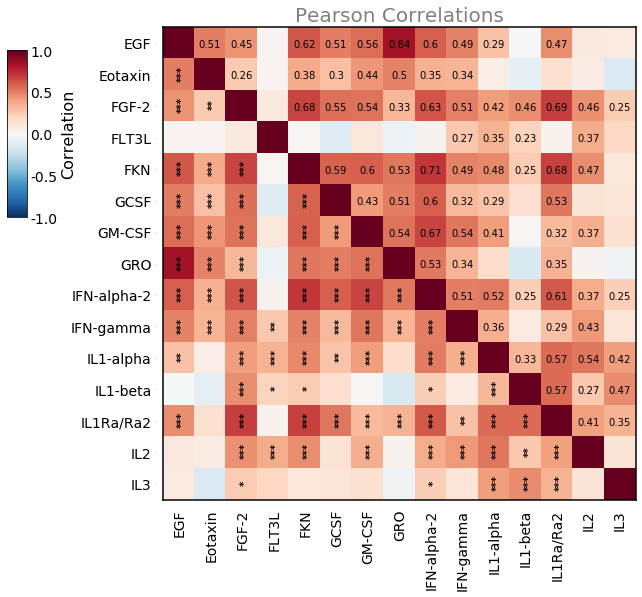
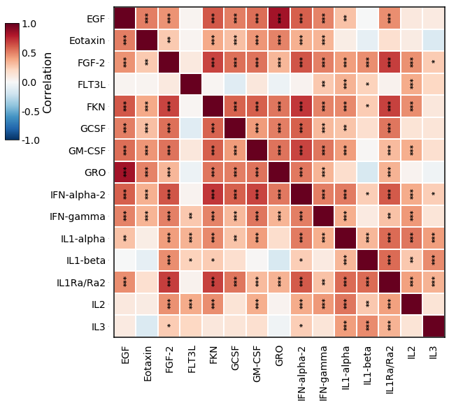
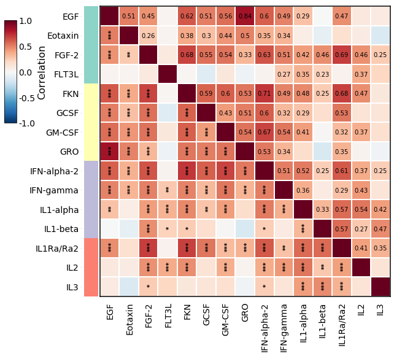
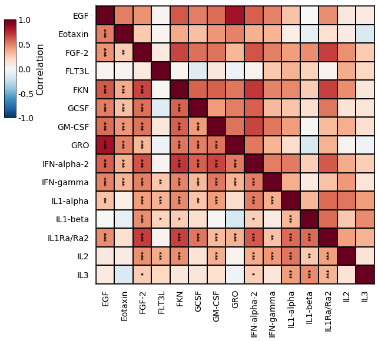
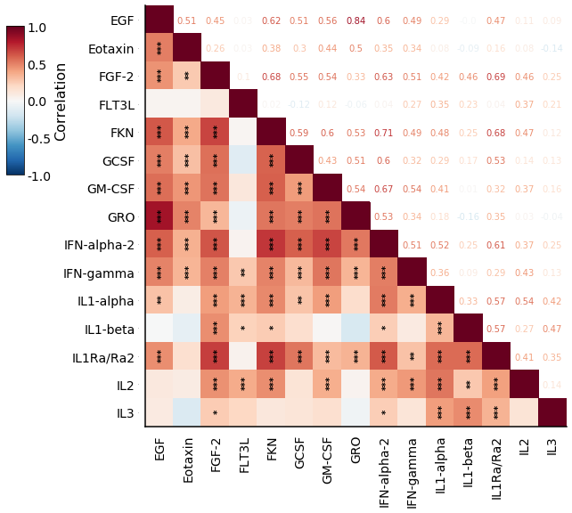
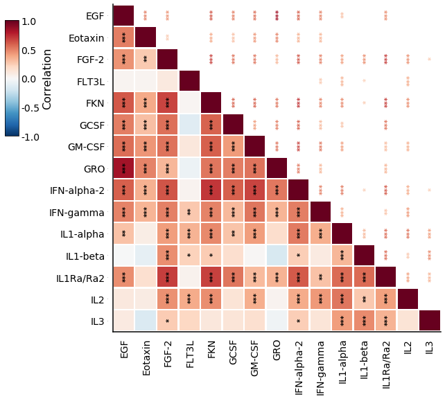
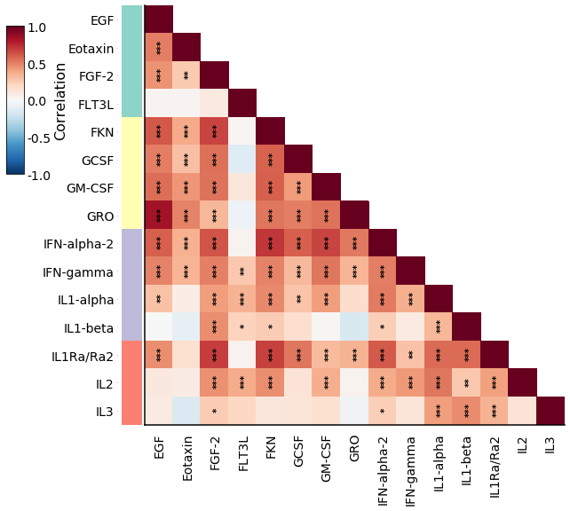

# SigniCorr

Script for plotting a pairwise correlation matrix as heatmap with annotated p-values, after applying multiplicity adjustment for multiple hypothesis testing.

# SigniCorr plot example


```python
''' If signi_corr.py is not in the same path as this notebook, 
uncomment the next 2 rows and change 'folder' to path where signi_corr.py is stored: '''
# import sys
# sys.path.append('folder') 

import signi_corr
import pandas as pd
import matplotlib.pyplot as plt
```

## Import example data


```python
df = pd.read_csv('cytokine_data.csv', index_col=0) # cytokine_data.csv shoulb be stored in the same folder as this notebook
df.dropna(axis='index', how='all', inplace=True)
df = df.iloc[:, 0:15]
df.head()
```


<div>
<style scoped>
    .dataframe tbody tr th:only-of-type {
        vertical-align: middle;
    }

    .dataframe tbody tr th {
        vertical-align: top;
    }

    .dataframe thead th {
        text-align: right;
    }
</style>
<table border="1" class="dataframe">
  <thead>
    <tr style="text-align: right;">
      <th></th>
      <th>EGF</th>
      <th>Eotaxin</th>
      <th>FGF-2</th>
      <th>FLT3L</th>
      <th>FKN</th>
      <th>GCSF</th>
      <th>GM-CSF</th>
      <th>GRO</th>
      <th>IFN-alpha-2</th>
      <th>IFN-gamma</th>
      <th>IL1-alpha</th>
      <th>IL1-beta</th>
      <th>IL1Ra/Ra2</th>
      <th>IL2</th>
      <th>IL3</th>
    </tr>
    <tr>
      <th>ID</th>
      <th></th>
      <th></th>
      <th></th>
      <th></th>
      <th></th>
      <th></th>
      <th></th>
      <th></th>
      <th></th>
      <th></th>
      <th></th>
      <th></th>
      <th></th>
      <th></th>
      <th></th>
    </tr>
  </thead>
  <tbody>
    <tr>
      <td>3200</td>
      <td>5.24</td>
      <td>24.34</td>
      <td>39.02</td>
      <td>1.94</td>
      <td>20.86</td>
      <td>39.52</td>
      <td>6.60</td>
      <td>98.41</td>
      <td>8.12</td>
      <td>9.97</td>
      <td>2.24</td>
      <td>2.83</td>
      <td>24.24</td>
      <td>0.95</td>
      <td>2.76</td>
    </tr>
    <tr>
      <td>3202</td>
      <td>179.16</td>
      <td>39.41</td>
      <td>28.62</td>
      <td>2.50</td>
      <td>49.11</td>
      <td>20.92</td>
      <td>356.27</td>
      <td>1019.90</td>
      <td>27.21</td>
      <td>8.36</td>
      <td>17.34</td>
      <td>1.80</td>
      <td>5.67</td>
      <td>1.49</td>
      <td>1.67</td>
    </tr>
    <tr>
      <td>3204</td>
      <td>191.72</td>
      <td>42.49</td>
      <td>7.68</td>
      <td>0.67</td>
      <td>33.36</td>
      <td>10.44</td>
      <td>22.71</td>
      <td>2038.28</td>
      <td>25.98</td>
      <td>7.36</td>
      <td>0.13</td>
      <td>0.28</td>
      <td>2.25</td>
      <td>0.45</td>
      <td>0.27</td>
    </tr>
    <tr>
      <td>3206</td>
      <td>132.00</td>
      <td>93.76</td>
      <td>33.89</td>
      <td>0.47</td>
      <td>128.00</td>
      <td>67.87</td>
      <td>147.00</td>
      <td>4132.00</td>
      <td>27.43</td>
      <td>13.54</td>
      <td>49.02</td>
      <td>0.18</td>
      <td>22.54</td>
      <td>3.48</td>
      <td>5.25</td>
    </tr>
    <tr>
      <td>3209</td>
      <td>12.91</td>
      <td>18.75</td>
      <td>17.37</td>
      <td>2.50</td>
      <td>2.62</td>
      <td>12.83</td>
      <td>231.27</td>
      <td>149.67</td>
      <td>6.48</td>
      <td>63.64</td>
      <td>10.52</td>
      <td>1.61</td>
      <td>1.88</td>
      <td>1.25</td>
      <td>1.67</td>
    </tr>
  </tbody>
</table>
</div>


Example categories


```python
categories = {col: 1+int(5*i/20) for i,col in enumerate(df.columns)}
print(categories)
```

    {'EGF': 1, 'Eotaxin': 1, 'FGF-2': 1, 'FLT3L': 1, 'FKN': 2, 'GCSF': 2, 'GM-CSF': 2, 'GRO': 2, 'IFN-alpha-2': 3, 'IFN-gamma': 3, 'IL1-alpha': 3, 'IL1-beta': 3, 'IL1Ra/Ra2': 4, 'IL2': 4, 'IL3': 4}
    

### plot_signi_corr function documentation


```python
help(signi_corr.plot_signi_corr)
```

    Help on function plot_signi_corr in module signi_corr:
    
    plot_signi_corr(df, method='spearman', show_significance=True, signif_by_method='FWER', censor_type='FDR', censor_thresh=1, color_only_lower_triangle=False, numbers_upper=True, asterisks_upper=False, figsize=(10, 8), title='', title_fontsize=20, title_color='black', colorbar_title='Correlation', colorscale_fontsize_title=16, colorscale_fontsize_ticks=14, ticks_fontsize=14, asterisks_x=0.6, asterisks_y=0.44, numbers_x=0.55, numbers_y=0.48, aster_size=10, numbers_size=10, grid_colors='white', grid_width=0, label_category=None, label_cmap=None, main_left=0.25, main_bottom=0.17, main_right=0.98, main_top=0.99, colorbar_left=0.01, colorbar_bottom=0.66, colorbar_right=0.04, colorbar_top=0.95)
        Gets a dataframe with numeric columns, calculates the pairwise correlations between
        the columns and portray them in a heatmap. Heatmap colors show the correlation coefficient.
        Correlation coefficients can be annotated with numbers (numbers_upper=True).
        Significance is annotated with asterisks (show_significance=True).
        pvalues can be adjusted for multiple testing using FDR or FWER (signif_by_method).
        * When show_significance=True, correlation coefficient number are only annotated
        if significant.
        Asterisks indicate p-values (or FDR or FWER) with ***, **, and *
        indicating p ≤ 0.0005, 0.005, and 0.05, respectively
        
        :param df: pandas dataframe
        :param method: for calculating correlations - 'spearman' or 'pearson'
        :param show_significance: show significance asterisks.
                                  If True, and numbers_upper is True,
                                  will only annotate numbers when significant
                                  (according to asterisks_by_method)
        :param signif_by_method: adjustment method to use for significance
                                 annotation - 'FWER', 'FDR' or 'pvals'
                                 (i.e., without multiplicity adjustment)
        :param censor_type: adjustment method to use for censoring cells -
                            'FWER', 'FDR' or 'pvals' (i.e., without multiplicity adjustment)
        :param censor_thresh: threshold over which cells should be censored based on
                              censor_type: adjustment method.
                              Defaule 1 - no censoring
        :param color_only_lower_triangle: Show only lower triangle heatmap (with or without
                                    annotating the correlation coefficient in the
                                    upper triangle - depending on parameter numbers_upper
        :param numbers_upper: annotate the correlation coefficient in the
                              upper triangle, only for significant values (unless show_significance=False)
        :param asterisks_upper: annotate the pvals in the upper triangle
        :param figsize: figure size
        :param title: figure title. Default ''
        :param title_fontsize: figure title fontsize. Default 20
        :param title_color: figure title fontsize. Default 'black'
        :param colorbar_title: colorbar label string
        :param colorscale_fontsize_title:
        :param colorscale_fontsize_ticks:
        :param ticks_fontsize: fontsize of the ticks (df column names)
        
        :param asterisks_x: shift the astersiks text on x axis
        :param asterisks_y: shift the astersiks text on y axis
        :param numbers_x: shift the numbers text on x axis
        :param numbers_y: shift the numbers text on y axis
        :param aster_size: fontsize of asterisks to annotate
        :param numbers_size: fontsize of numbers to annotate
        :param grid_colors: heatmap "grid" color
        :param grid_width: heatmap "grid" line width
        :param label_category: pd.Series - add color to each row by these categories.
        :param label_cmap: color map for label categories
        :param main_left: shift the heatmap edges
        :param main_bottom: shift the heatmap edges
        :param main_right: shift the heatmap edges
        :param main_top: shift the heatmap edges
        :param colorbar_left: shift the colorbar edges
        :param colorbar_bottom: shift the colorbar edges
        :param colorbar_right: shift the colorbar edges
        :param colorbar_top: shift the colorbar edges
        
        :return: matplotlib figure object,
                 correlations matrix,
                 dictionary containing pvalues matrics (original p-values, FWER p-values, FDR p-values)
    
    

## Example SigniCorr Plots


```python
fig, corrs, pvals = signi_corr.plot_signi_corr(df, method='spearman',
                                              show_significance=True,
                                              signif_by_method='FWER', censor_type='FDR',
                                              color_only_lower_triangle=False,
                                              numbers_upper=True,
                                              asterisks_upper=False,
                                              figsize=(9, 8),
                                              title='Pearson Correlations', title_fontsize=20, title_color='grey'
                                              )
plt.show()
```

    Warning! a diag value is not 1. check for double indexes!
    Warning! a diag value is not 1. check for double indexes!
    Warning! a diag value is not 1. check for double indexes!
    Warning! a diag value is not 1. check for double indexes!
    Warning! a diag value is not 1. check for double indexes!
    

    D:\Liel\Dropbox\PyCharm\PycharmProjectsNew\SigniCorr\signi_corr.py:417: UserWarning: This figure includes Axes that are not compatible with tight_layout, so results might be incorrect.
      plt.tight_layout()
    


    

    


```python
fig, corrs, pvals = signi_corr.plot_signi_corr(df, method='spearman',
                                              show_significance=True,
                                              signif_by_method='FWER', censor_type='FDR',
                                              color_only_lower_triangle=False,
                                              numbers_upper=False,
                                              asterisks_upper=True,
                                              figsize=(9, 8),
                                              grid_colors='white', grid_width=1,
                                              )
plt.show()
```

    Warning! a diag value is not 1. check for double indexes!
    Warning! a diag value is not 1. check for double indexes!
    Warning! a diag value is not 1. check for double indexes!
    Warning! a diag value is not 1. check for double indexes!
    Warning! a diag value is not 1. check for double indexes!
    


    

    


```python
fig, corrs, pvals = signi_corr.plot_signi_corr(df, method='spearman',
                                              show_significance=True,
                                              signif_by_method='FWER', censor_type='FDR',
                                              color_only_lower_triangle=False,
                                              numbers_upper=True,
                                              asterisks_upper=False,
                                              figsize=(9, 8),
                                              grid_colors='white', grid_width=1,
                                              label_category=pd.Series(categories)
                                              )
plt.show()
```

    Warning! a diag value is not 1. check for double indexes!
    Warning! a diag value is not 1. check for double indexes!
    Warning! a diag value is not 1. check for double indexes!
    Warning! a diag value is not 1. check for double indexes!
    Warning! a diag value is not 1. check for double indexes!
    


    

    


```python
fig, corrs, pvals = signi_corr.plot_signi_corr(df, method='spearman',
                                              show_significance=True,
                                              signif_by_method='FWER', censor_type='FDR',
                                              color_only_lower_triangle=False,
                                              numbers_upper=False,
                                              asterisks_upper=False,
                                              figsize=(9, 8),
                                              grid_colors='black', grid_width=1,
                                              )
plt.show()
```

    Warning! a diag value is not 1. check for double indexes!
    Warning! a diag value is not 1. check for double indexes!
    Warning! a diag value is not 1. check for double indexes!
    Warning! a diag value is not 1. check for double indexes!
    Warning! a diag value is not 1. check for double indexes!
    


    

    


```python
fig, corrs, pvals = signi_corr.plot_signi_corr(df, method='spearman',
                                              show_significance=True,
                                              signif_by_method='FWER', censor_type='FDR',
                                              color_only_lower_triangle=True,
                                              numbers_upper=True,
                                              asterisks_upper=False,
                                              figsize=(9, 8),
                                              )
plt.show()
```

    Warning! a diag value is not 1. check for double indexes!
    Warning! a diag value is not 1. check for double indexes!
    Warning! a diag value is not 1. check for double indexes!
    Warning! a diag value is not 1. check for double indexes!
    Warning! a diag value is not 1. check for double indexes!
    


    

    


```python
fig, corrs, pvals = signi_corr.plot_signi_corr(df, method='spearman',
                                              show_significance=True,
                                              signif_by_method='FWER', censor_type='FDR',
                                              color_only_lower_triangle=True,
                                              numbers_upper=False,
                                              asterisks_upper=True,
                                              figsize=(9, 8),
                                              grid_colors='white', grid_width=1.4,
                                              )
plt.show()
```

    Warning! a diag value is not 1. check for double indexes!
    Warning! a diag value is not 1. check for double indexes!
    Warning! a diag value is not 1. check for double indexes!
    Warning! a diag value is not 1. check for double indexes!
    Warning! a diag value is not 1. check for double indexes!
    


    

    


```python
fig, corrs, pvals = signi_corr.plot_signi_corr(df, method='spearman',
                                              show_significance=True,
                                              signif_by_method='FWER', censor_type='FDR',
                                              color_only_lower_triangle=True,
                                              numbers_upper=False,
                                              asterisks_upper=False,
                                              figsize=(9, 8),
                                              label_category=pd.Series(categories)
                                              )
plt.show()
```

    Warning! a diag value is not 1. check for double indexes!
    Warning! a diag value is not 1. check for double indexes!
    Warning! a diag value is not 1. check for double indexes!
    Warning! a diag value is not 1. check for double indexes!
    Warning! a diag value is not 1. check for double indexes!
    


    

    


## Other output matrices

### Correlation coefficients matrix


```python
corrs
```


<div>
<style scoped>
    .dataframe tbody tr th:only-of-type {
        vertical-align: middle;
    }

    .dataframe tbody tr th {
        vertical-align: top;
    }

    .dataframe thead th {
        text-align: right;
    }
</style>
<table border="1" class="dataframe">
  <thead>
    <tr style="text-align: right;">
      <th></th>
      <th>EGF</th>
      <th>Eotaxin</th>
      <th>FGF-2</th>
      <th>FLT3L</th>
      <th>FKN</th>
      <th>GCSF</th>
      <th>GM-CSF</th>
      <th>GRO</th>
      <th>IFN-alpha-2</th>
      <th>IFN-gamma</th>
      <th>IL1-alpha</th>
      <th>IL1-beta</th>
      <th>IL1Ra/Ra2</th>
      <th>IL2</th>
      <th>IL3</th>
    </tr>
  </thead>
  <tbody>
    <tr>
      <td>EGF</td>
      <td>1</td>
      <td>0.508698</td>
      <td>0.447039</td>
      <td>0.0307883</td>
      <td>0.620252</td>
      <td>0.508588</td>
      <td>0.562433</td>
      <td>0.840942</td>
      <td>0.600046</td>
      <td>0.492281</td>
      <td>0.289657</td>
      <td>-0.000456858</td>
      <td>0.465559</td>
      <td>0.105147</td>
      <td>0.0909513</td>
    </tr>
    <tr>
      <td>Eotaxin</td>
      <td>0.508698</td>
      <td>1</td>
      <td>0.263933</td>
      <td>0.0298888</td>
      <td>0.38151</td>
      <td>0.300034</td>
      <td>0.442648</td>
      <td>0.495779</td>
      <td>0.352003</td>
      <td>0.340264</td>
      <td>0.0773238</td>
      <td>-0.0913095</td>
      <td>0.158192</td>
      <td>0.0804187</td>
      <td>-0.144399</td>
    </tr>
    <tr>
      <td>FGF-2</td>
      <td>0.447039</td>
      <td>0.263933</td>
      <td>1</td>
      <td>0.0998169</td>
      <td>0.675528</td>
      <td>0.553776</td>
      <td>0.541312</td>
      <td>0.329312</td>
      <td>0.626584</td>
      <td>0.506014</td>
      <td>0.417709</td>
      <td>0.461328</td>
      <td>0.691803</td>
      <td>0.459918</td>
      <td>0.251261</td>
    </tr>
    <tr>
      <td>FLT3L</td>
      <td>0.0307883</td>
      <td>0.0298888</td>
      <td>0.0998169</td>
      <td>1</td>
      <td>0.0172762</td>
      <td>-0.117442</td>
      <td>0.115531</td>
      <td>-0.0594644</td>
      <td>0.0369964</td>
      <td>0.272172</td>
      <td>0.349361</td>
      <td>0.228364</td>
      <td>0.0430386</td>
      <td>0.370598</td>
      <td>0.206078</td>
    </tr>
    <tr>
      <td>FKN</td>
      <td>0.620252</td>
      <td>0.38151</td>
      <td>0.675528</td>
      <td>0.0172762</td>
      <td>1</td>
      <td>0.587669</td>
      <td>0.595532</td>
      <td>0.533172</td>
      <td>0.714254</td>
      <td>0.492448</td>
      <td>0.484157</td>
      <td>0.254691</td>
      <td>0.680845</td>
      <td>0.465619</td>
      <td>0.116719</td>
    </tr>
    <tr>
      <td>GCSF</td>
      <td>0.508588</td>
      <td>0.300034</td>
      <td>0.553776</td>
      <td>-0.117442</td>
      <td>0.587669</td>
      <td>1</td>
      <td>0.427999</td>
      <td>0.510248</td>
      <td>0.597775</td>
      <td>0.324436</td>
      <td>0.288631</td>
      <td>0.167053</td>
      <td>0.534719</td>
      <td>0.136985</td>
      <td>0.126387</td>
    </tr>
    <tr>
      <td>GM-CSF</td>
      <td>0.562433</td>
      <td>0.442648</td>
      <td>0.541312</td>
      <td>0.115531</td>
      <td>0.595532</td>
      <td>0.427999</td>
      <td>1</td>
      <td>0.542386</td>
      <td>0.6738</td>
      <td>0.535593</td>
      <td>0.414617</td>
      <td>0.0124068</td>
      <td>0.316784</td>
      <td>0.365116</td>
      <td>0.156287</td>
    </tr>
    <tr>
      <td>GRO</td>
      <td>0.840942</td>
      <td>0.495779</td>
      <td>0.329312</td>
      <td>-0.0594644</td>
      <td>0.533172</td>
      <td>0.510248</td>
      <td>0.542386</td>
      <td>1</td>
      <td>0.526761</td>
      <td>0.338122</td>
      <td>0.177202</td>
      <td>-0.158133</td>
      <td>0.349164</td>
      <td>0.0330376</td>
      <td>-0.0413234</td>
    </tr>
    <tr>
      <td>IFN-alpha-2</td>
      <td>0.600046</td>
      <td>0.352003</td>
      <td>0.626584</td>
      <td>0.0369964</td>
      <td>0.714254</td>
      <td>0.597775</td>
      <td>0.6738</td>
      <td>0.526761</td>
      <td>1</td>
      <td>0.509552</td>
      <td>0.515988</td>
      <td>0.24555</td>
      <td>0.610041</td>
      <td>0.36764</td>
      <td>0.248783</td>
    </tr>
    <tr>
      <td>IFN-gamma</td>
      <td>0.492281</td>
      <td>0.340264</td>
      <td>0.506014</td>
      <td>0.272172</td>
      <td>0.492448</td>
      <td>0.324436</td>
      <td>0.535593</td>
      <td>0.338122</td>
      <td>0.509552</td>
      <td>1</td>
      <td>0.36153</td>
      <td>0.0875979</td>
      <td>0.292833</td>
      <td>0.430793</td>
      <td>0.130602</td>
    </tr>
    <tr>
      <td>IL1-alpha</td>
      <td>0.289657</td>
      <td>0.0773238</td>
      <td>0.417709</td>
      <td>0.349361</td>
      <td>0.484157</td>
      <td>0.288631</td>
      <td>0.414617</td>
      <td>0.177202</td>
      <td>0.515988</td>
      <td>0.36153</td>
      <td>1</td>
      <td>0.329751</td>
      <td>0.566598</td>
      <td>0.536223</td>
      <td>0.418899</td>
    </tr>
    <tr>
      <td>IL1-beta</td>
      <td>-0.000456858</td>
      <td>-0.0913095</td>
      <td>0.461328</td>
      <td>0.228364</td>
      <td>0.254691</td>
      <td>0.167053</td>
      <td>0.0124068</td>
      <td>-0.158133</td>
      <td>0.24555</td>
      <td>0.0875979</td>
      <td>0.329751</td>
      <td>1</td>
      <td>0.567743</td>
      <td>0.272144</td>
      <td>0.471607</td>
    </tr>
    <tr>
      <td>IL1Ra/Ra2</td>
      <td>0.465559</td>
      <td>0.158192</td>
      <td>0.691803</td>
      <td>0.0430386</td>
      <td>0.680845</td>
      <td>0.534719</td>
      <td>0.316784</td>
      <td>0.349164</td>
      <td>0.610041</td>
      <td>0.292833</td>
      <td>0.566598</td>
      <td>0.567743</td>
      <td>1</td>
      <td>0.413813</td>
      <td>0.350234</td>
    </tr>
    <tr>
      <td>IL2</td>
      <td>0.105147</td>
      <td>0.0804187</td>
      <td>0.459918</td>
      <td>0.370598</td>
      <td>0.465619</td>
      <td>0.136985</td>
      <td>0.365116</td>
      <td>0.0330376</td>
      <td>0.36764</td>
      <td>0.430793</td>
      <td>0.536223</td>
      <td>0.272144</td>
      <td>0.413813</td>
      <td>1</td>
      <td>0.140108</td>
    </tr>
    <tr>
      <td>IL3</td>
      <td>0.0909513</td>
      <td>-0.144399</td>
      <td>0.251261</td>
      <td>0.206078</td>
      <td>0.116719</td>
      <td>0.126387</td>
      <td>0.156287</td>
      <td>-0.0413234</td>
      <td>0.248783</td>
      <td>0.130602</td>
      <td>0.418899</td>
      <td>0.471607</td>
      <td>0.350234</td>
      <td>0.140108</td>
      <td>1</td>
    </tr>
  </tbody>
</table>
</div>


### Correlation p-values matrix


```python
pvals['pvals']
```


<div>
<style scoped>
    .dataframe tbody tr th:only-of-type {
        vertical-align: middle;
    }

    .dataframe tbody tr th {
        vertical-align: top;
    }

    .dataframe thead th {
        text-align: right;
    }
</style>
<table border="1" class="dataframe">
  <thead>
    <tr style="text-align: right;">
      <th></th>
      <th>EGF</th>
      <th>Eotaxin</th>
      <th>FGF-2</th>
      <th>FLT3L</th>
      <th>FKN</th>
      <th>GCSF</th>
      <th>GM-CSF</th>
      <th>GRO</th>
      <th>IFN-alpha-2</th>
      <th>IFN-gamma</th>
      <th>IL1-alpha</th>
      <th>IL1-beta</th>
      <th>IL1Ra/Ra2</th>
      <th>IL2</th>
      <th>IL3</th>
    </tr>
  </thead>
  <tbody>
    <tr>
      <td>EGF</td>
      <td>0.000000e+00</td>
      <td>1.496041e-15</td>
      <td>5.851253e-12</td>
      <td>6.534895e-01</td>
      <td>3.008084e-24</td>
      <td>1.520550e-15</td>
      <td>2.477574e-19</td>
      <td>1.009126e-58</td>
      <td>2.040425e-22</td>
      <td>1.595437e-14</td>
      <td>1.593686e-05</td>
      <td>9.946863e-01</td>
      <td>5.792978e-13</td>
      <td>1.242847e-01</td>
      <td>1.839836e-01</td>
    </tr>
    <tr>
      <td>Eotaxin</td>
      <td>1.496041e-15</td>
      <td>0.000000e+00</td>
      <td>8.960513e-05</td>
      <td>6.629829e-01</td>
      <td>7.399579e-09</td>
      <td>7.559070e-06</td>
      <td>9.922887e-12</td>
      <td>9.738035e-15</td>
      <td>1.145706e-07</td>
      <td>3.161148e-07</td>
      <td>2.589522e-01</td>
      <td>1.822554e-01</td>
      <td>2.030503e-02</td>
      <td>2.403157e-01</td>
      <td>3.433933e-02</td>
    </tr>
    <tr>
      <td>FGF-2</td>
      <td>5.851253e-12</td>
      <td>8.960513e-05</td>
      <td>0.000000e+00</td>
      <td>1.446430e-01</td>
      <td>5.221195e-30</td>
      <td>1.121167e-18</td>
      <td>9.140832e-18</td>
      <td>7.853563e-07</td>
      <td>7.527905e-25</td>
      <td>2.222293e-15</td>
      <td>1.732770e-10</td>
      <td>9.947763e-13</td>
      <td>5.951129e-32</td>
      <td>1.189264e-12</td>
      <td>1.971526e-04</td>
    </tr>
    <tr>
      <td>FLT3L</td>
      <td>6.534895e-01</td>
      <td>6.629829e-01</td>
      <td>1.446430e-01</td>
      <td>0.000000e+00</td>
      <td>8.011481e-01</td>
      <td>8.580467e-02</td>
      <td>9.106489e-02</td>
      <td>3.856109e-01</td>
      <td>5.895450e-01</td>
      <td>5.250896e-05</td>
      <td>1.444973e-07</td>
      <td>7.418227e-04</td>
      <td>5.302127e-01</td>
      <td>2.104916e-08</td>
      <td>2.391521e-03</td>
    </tr>
    <tr>
      <td>FKN</td>
      <td>3.008084e-24</td>
      <td>7.399579e-09</td>
      <td>5.221195e-30</td>
      <td>8.011481e-01</td>
      <td>0.000000e+00</td>
      <td>2.338712e-21</td>
      <td>5.026956e-22</td>
      <td>3.436109e-17</td>
      <td>7.453199e-35</td>
      <td>1.558613e-14</td>
      <td>4.915989e-14</td>
      <td>1.598931e-04</td>
      <td>1.249636e-30</td>
      <td>5.748454e-13</td>
      <td>8.776539e-02</td>
    </tr>
    <tr>
      <td>GCSF</td>
      <td>1.520550e-15</td>
      <td>7.559070e-06</td>
      <td>1.121167e-18</td>
      <td>8.580467e-02</td>
      <td>2.338712e-21</td>
      <td>0.000000e+00</td>
      <td>5.476213e-11</td>
      <td>1.188471e-15</td>
      <td>3.217157e-22</td>
      <td>1.164476e-06</td>
      <td>1.713018e-05</td>
      <td>1.418871e-02</td>
      <td>2.679123e-17</td>
      <td>4.481834e-02</td>
      <td>6.434043e-02</td>
    </tr>
    <tr>
      <td>GM-CSF</td>
      <td>2.477574e-19</td>
      <td>9.922887e-12</td>
      <td>9.140832e-18</td>
      <td>9.106489e-02</td>
      <td>5.026956e-22</td>
      <td>5.476213e-11</td>
      <td>0.000000e+00</td>
      <td>7.654922e-18</td>
      <td>8.255846e-30</td>
      <td>2.326315e-17</td>
      <td>2.430834e-10</td>
      <td>8.564732e-01</td>
      <td>2.131450e-06</td>
      <td>3.508063e-08</td>
      <td>2.188489e-02</td>
    </tr>
    <tr>
      <td>GRO</td>
      <td>1.009126e-58</td>
      <td>9.738035e-15</td>
      <td>7.853563e-07</td>
      <td>3.856109e-01</td>
      <td>3.436109e-17</td>
      <td>1.188471e-15</td>
      <td>7.654922e-18</td>
      <td>0.000000e+00</td>
      <td>9.510225e-17</td>
      <td>3.787583e-07</td>
      <td>9.219959e-03</td>
      <td>2.035296e-02</td>
      <td>1.469984e-07</td>
      <td>6.299948e-01</td>
      <td>5.467448e-01</td>
    </tr>
    <tr>
      <td>IFN-alpha-2</td>
      <td>2.040425e-22</td>
      <td>1.145706e-07</td>
      <td>7.527905e-25</td>
      <td>5.895450e-01</td>
      <td>7.453199e-35</td>
      <td>3.217157e-22</td>
      <td>8.255846e-30</td>
      <td>9.510225e-17</td>
      <td>0.000000e+00</td>
      <td>1.318162e-15</td>
      <td>5.017173e-16</td>
      <td>2.776658e-04</td>
      <td>2.631672e-23</td>
      <td>2.776017e-08</td>
      <td>2.289613e-04</td>
    </tr>
    <tr>
      <td>IFN-gamma</td>
      <td>1.595437e-14</td>
      <td>3.161148e-07</td>
      <td>2.222293e-15</td>
      <td>5.250896e-05</td>
      <td>1.558613e-14</td>
      <td>1.164476e-06</td>
      <td>2.326315e-17</td>
      <td>3.787583e-07</td>
      <td>1.318162e-15</td>
      <td>0.000000e+00</td>
      <td>4.874483e-08</td>
      <td>2.007528e-01</td>
      <td>1.272332e-05</td>
      <td>3.978473e-11</td>
      <td>5.587231e-02</td>
    </tr>
    <tr>
      <td>IL1-alpha</td>
      <td>1.593686e-05</td>
      <td>2.589522e-01</td>
      <td>1.732770e-10</td>
      <td>1.444973e-07</td>
      <td>4.915989e-14</td>
      <td>1.713018e-05</td>
      <td>2.430834e-10</td>
      <td>9.219959e-03</td>
      <td>5.017173e-16</td>
      <td>4.874483e-08</td>
      <td>0.000000e+00</td>
      <td>7.577122e-07</td>
      <td>1.179383e-19</td>
      <td>2.100708e-17</td>
      <td>1.519654e-10</td>
    </tr>
    <tr>
      <td>IL1-beta</td>
      <td>9.946863e-01</td>
      <td>1.822554e-01</td>
      <td>9.947763e-13</td>
      <td>7.418227e-04</td>
      <td>1.598931e-04</td>
      <td>1.418871e-02</td>
      <td>8.564732e-01</td>
      <td>2.035296e-02</td>
      <td>2.776658e-04</td>
      <td>2.007528e-01</td>
      <td>7.577122e-07</td>
      <td>0.000000e+00</td>
      <td>9.599521e-20</td>
      <td>5.260397e-05</td>
      <td>2.640034e-13</td>
    </tr>
    <tr>
      <td>IL1Ra/Ra2</td>
      <td>5.792978e-13</td>
      <td>2.030503e-02</td>
      <td>5.951129e-32</td>
      <td>5.302127e-01</td>
      <td>1.249636e-30</td>
      <td>2.679123e-17</td>
      <td>2.131450e-06</td>
      <td>1.469984e-07</td>
      <td>2.631672e-23</td>
      <td>1.272332e-05</td>
      <td>1.179383e-19</td>
      <td>9.599521e-20</td>
      <td>0.000000e+00</td>
      <td>2.652988e-10</td>
      <td>1.338573e-07</td>
    </tr>
    <tr>
      <td>IL2</td>
      <td>1.242847e-01</td>
      <td>2.403157e-01</td>
      <td>1.189264e-12</td>
      <td>2.104916e-08</td>
      <td>5.748454e-13</td>
      <td>4.481834e-02</td>
      <td>3.508063e-08</td>
      <td>6.299948e-01</td>
      <td>2.776017e-08</td>
      <td>3.978473e-11</td>
      <td>2.100708e-17</td>
      <td>5.260397e-05</td>
      <td>2.652988e-10</td>
      <td>0.000000e+00</td>
      <td>4.011612e-02</td>
    </tr>
    <tr>
      <td>IL3</td>
      <td>1.839836e-01</td>
      <td>3.433933e-02</td>
      <td>1.971526e-04</td>
      <td>2.391521e-03</td>
      <td>8.776539e-02</td>
      <td>6.434043e-02</td>
      <td>2.188489e-02</td>
      <td>5.467448e-01</td>
      <td>2.289613e-04</td>
      <td>5.587231e-02</td>
      <td>1.519654e-10</td>
      <td>2.640034e-13</td>
      <td>1.338573e-07</td>
      <td>4.011612e-02</td>
      <td>0.000000e+00</td>
    </tr>
  </tbody>
</table>
</div>


### Correlation FWER adjusted p-values matrix


```python
pvals['FWER']
```


<div>
<style scoped>
    .dataframe tbody tr th:only-of-type {
        vertical-align: middle;
    }

    .dataframe tbody tr th {
        vertical-align: top;
    }

    .dataframe thead th {
        text-align: right;
    }
</style>
<table border="1" class="dataframe">
  <thead>
    <tr style="text-align: right;">
      <th></th>
      <th>EGF</th>
      <th>Eotaxin</th>
      <th>FGF-2</th>
      <th>FLT3L</th>
      <th>FKN</th>
      <th>GCSF</th>
      <th>GM-CSF</th>
      <th>GRO</th>
      <th>IFN-alpha-2</th>
      <th>IFN-gamma</th>
      <th>IL1-alpha</th>
      <th>IL1-beta</th>
      <th>IL1Ra/Ra2</th>
      <th>IL2</th>
      <th>IL3</th>
    </tr>
  </thead>
  <tbody>
    <tr>
      <td>EGF</td>
      <td>0.000000e+00</td>
      <td>1.166912e-13</td>
      <td>3.861827e-10</td>
      <td>1.000000</td>
      <td>2.947923e-22</td>
      <td>1.170824e-13</td>
      <td>2.229816e-17</td>
      <td>1.059582e-56</td>
      <td>1.958808e-20</td>
      <td>1.164669e-12</td>
      <td>6.534111e-04</td>
      <td>1.000000e+00</td>
      <td>4.023918e-11</td>
      <td>1.000000e+00</td>
      <td>1.000000e+00</td>
    </tr>
    <tr>
      <td>Eotaxin</td>
      <td>1.166912e-13</td>
      <td>0.000000e+00</td>
      <td>3.315390e-03</td>
      <td>1.000000</td>
      <td>4.291756e-07</td>
      <td>3.250400e-04</td>
      <td>6.449877e-10</td>
      <td>7.303526e-13</td>
      <td>6.072241e-06</td>
      <td>1.548962e-05</td>
      <td>1.000000e+00</td>
      <td>1.000000e+00</td>
      <td>5.685409e-01</td>
      <td>1.000000e+00</td>
      <td>8.584832e-01</td>
    </tr>
    <tr>
      <td>FGF-2</td>
      <td>3.861827e-10</td>
      <td>3.315390e-03</td>
      <td>0.000000e+00</td>
      <td>1.000000</td>
      <td>5.273407e-28</td>
      <td>9.978387e-17</td>
      <td>7.952524e-16</td>
      <td>3.612639e-05</td>
      <td>7.452626e-23</td>
      <td>1.688943e-13</td>
      <td>1.056990e-08</td>
      <td>6.764479e-11</td>
      <td>6.129663e-30</td>
      <td>7.968070e-11</td>
      <td>6.900342e-03</td>
    </tr>
    <tr>
      <td>FLT3L</td>
      <td>1.000000e+00</td>
      <td>1.000000e+00</td>
      <td>1.000000e+00</td>
      <td>0.000000</td>
      <td>1.000000e+00</td>
      <td>1.000000e+00</td>
      <td>1.000000e+00</td>
      <td>1.000000e+00</td>
      <td>1.000000e+00</td>
      <td>2.047849e-03</td>
      <td>7.369362e-06</td>
      <td>2.373833e-02</td>
      <td>1.000000e+00</td>
      <td>1.199802e-06</td>
      <td>7.413714e-02</td>
    </tr>
    <tr>
      <td>FKN</td>
      <td>2.947923e-22</td>
      <td>4.291756e-07</td>
      <td>5.273407e-28</td>
      <td>1.000000</td>
      <td>0.000000e+00</td>
      <td>2.175003e-19</td>
      <td>4.725338e-20</td>
      <td>2.851970e-15</td>
      <td>7.751327e-33</td>
      <td>1.153373e-12</td>
      <td>3.539512e-12</td>
      <td>5.756151e-03</td>
      <td>1.274629e-28</td>
      <td>4.023918e-11</td>
      <td>1.000000e+00</td>
    </tr>
    <tr>
      <td>GCSF</td>
      <td>1.170824e-13</td>
      <td>3.250400e-04</td>
      <td>9.978387e-17</td>
      <td>1.000000</td>
      <td>2.175003e-19</td>
      <td>0.000000e+00</td>
      <td>3.450014e-09</td>
      <td>9.507767e-14</td>
      <td>3.056299e-20</td>
      <td>5.240140e-05</td>
      <td>6.852071e-04</td>
      <td>4.114726e-01</td>
      <td>2.250463e-15</td>
      <td>1.000000e+00</td>
      <td>1.000000e+00</td>
    </tr>
    <tr>
      <td>GM-CSF</td>
      <td>2.229816e-17</td>
      <td>6.449877e-10</td>
      <td>7.952524e-16</td>
      <td>1.000000</td>
      <td>4.725338e-20</td>
      <td>3.450014e-09</td>
      <td>0.000000e+00</td>
      <td>6.736332e-16</td>
      <td>8.255846e-28</td>
      <td>1.977368e-15</td>
      <td>1.458501e-08</td>
      <td>1.000000e+00</td>
      <td>9.378381e-05</td>
      <td>1.929434e-06</td>
      <td>5.690071e-01</td>
    </tr>
    <tr>
      <td>GRO</td>
      <td>1.059582e-56</td>
      <td>7.303526e-13</td>
      <td>3.612639e-05</td>
      <td>1.000000</td>
      <td>2.851970e-15</td>
      <td>9.507767e-14</td>
      <td>6.736332e-16</td>
      <td>0.000000e+00</td>
      <td>7.798384e-15</td>
      <td>1.818040e-05</td>
      <td>2.765988e-01</td>
      <td>5.685409e-01</td>
      <td>7.369362e-06</td>
      <td>1.000000e+00</td>
      <td>1.000000e+00</td>
    </tr>
    <tr>
      <td>IFN-alpha-2</td>
      <td>1.958808e-20</td>
      <td>6.072241e-06</td>
      <td>7.452626e-23</td>
      <td>1.000000</td>
      <td>7.751327e-33</td>
      <td>3.056299e-20</td>
      <td>8.255846e-28</td>
      <td>7.798384e-15</td>
      <td>0.000000e+00</td>
      <td>1.041348e-13</td>
      <td>4.063910e-14</td>
      <td>9.162972e-03</td>
      <td>2.552722e-21</td>
      <td>1.554570e-06</td>
      <td>7.784683e-03</td>
    </tr>
    <tr>
      <td>IFN-gamma</td>
      <td>1.164669e-12</td>
      <td>1.548962e-05</td>
      <td>1.688943e-13</td>
      <td>0.002048</td>
      <td>1.153373e-12</td>
      <td>5.240140e-05</td>
      <td>1.977368e-15</td>
      <td>1.818040e-05</td>
      <td>1.041348e-13</td>
      <td>0.000000e+00</td>
      <td>2.632221e-06</td>
      <td>1.000000e+00</td>
      <td>5.343795e-04</td>
      <td>2.546223e-09</td>
      <td>1.000000e+00</td>
    </tr>
    <tr>
      <td>IL1-alpha</td>
      <td>6.534111e-04</td>
      <td>1.000000e+00</td>
      <td>1.056990e-08</td>
      <td>0.000007</td>
      <td>3.539512e-12</td>
      <td>6.852071e-04</td>
      <td>1.458501e-08</td>
      <td>2.765988e-01</td>
      <td>4.063910e-14</td>
      <td>2.632221e-06</td>
      <td>0.000000e+00</td>
      <td>3.561247e-05</td>
      <td>1.073239e-17</td>
      <td>1.806609e-15</td>
      <td>9.421857e-09</td>
    </tr>
    <tr>
      <td>IL1-beta</td>
      <td>1.000000e+00</td>
      <td>1.000000e+00</td>
      <td>6.764479e-11</td>
      <td>0.023738</td>
      <td>5.756151e-03</td>
      <td>4.114726e-01</td>
      <td>1.000000e+00</td>
      <td>5.685409e-01</td>
      <td>9.162972e-03</td>
      <td>1.000000e+00</td>
      <td>3.561247e-05</td>
      <td>0.000000e+00</td>
      <td>8.831559e-18</td>
      <td>2.047849e-03</td>
      <td>1.874424e-11</td>
    </tr>
    <tr>
      <td>IL1Ra/Ra2</td>
      <td>4.023918e-11</td>
      <td>5.685409e-01</td>
      <td>6.129663e-30</td>
      <td>1.000000</td>
      <td>1.274629e-28</td>
      <td>2.250463e-15</td>
      <td>9.378381e-05</td>
      <td>7.369362e-06</td>
      <td>2.552722e-21</td>
      <td>5.343795e-04</td>
      <td>1.073239e-17</td>
      <td>8.831559e-18</td>
      <td>0.000000e+00</td>
      <td>1.565263e-08</td>
      <td>6.960579e-06</td>
    </tr>
    <tr>
      <td>IL2</td>
      <td>1.000000e+00</td>
      <td>1.000000e+00</td>
      <td>7.968070e-11</td>
      <td>0.000001</td>
      <td>4.023918e-11</td>
      <td>1.000000e+00</td>
      <td>1.929434e-06</td>
      <td>1.000000e+00</td>
      <td>1.554570e-06</td>
      <td>2.546223e-09</td>
      <td>1.806609e-15</td>
      <td>2.047849e-03</td>
      <td>1.565263e-08</td>
      <td>0.000000e+00</td>
      <td>9.627870e-01</td>
    </tr>
    <tr>
      <td>IL3</td>
      <td>1.000000e+00</td>
      <td>8.584832e-01</td>
      <td>6.900342e-03</td>
      <td>0.074137</td>
      <td>1.000000e+00</td>
      <td>1.000000e+00</td>
      <td>5.690071e-01</td>
      <td>1.000000e+00</td>
      <td>7.784683e-03</td>
      <td>1.000000e+00</td>
      <td>9.421857e-09</td>
      <td>1.874424e-11</td>
      <td>6.960579e-06</td>
      <td>9.627870e-01</td>
      <td>0.000000e+00</td>
    </tr>
  </tbody>
</table>
</div>


### Correlation FDR adjusted p-values matrix


```python
pvals['FDR']
```


<div>
<style scoped>
    .dataframe tbody tr th:only-of-type {
        vertical-align: middle;
    }

    .dataframe tbody tr th {
        vertical-align: top;
    }

    .dataframe thead th {
        text-align: right;
    }
</style>
<table border="1" class="dataframe">
  <thead>
    <tr style="text-align: right;">
      <th></th>
      <th>EGF</th>
      <th>Eotaxin</th>
      <th>FGF-2</th>
      <th>FLT3L</th>
      <th>FKN</th>
      <th>GCSF</th>
      <th>GM-CSF</th>
      <th>GRO</th>
      <th>IFN-alpha-2</th>
      <th>IFN-gamma</th>
      <th>IL1-alpha</th>
      <th>IL1-beta</th>
      <th>IL1Ra/Ra2</th>
      <th>IL2</th>
      <th>IL3</th>
    </tr>
  </thead>
  <tbody>
    <tr>
      <td>EGF</td>
      <td>0.000000e+00</td>
      <td>5.505440e-15</td>
      <td>1.535954e-11</td>
      <td>6.793702e-01</td>
      <td>3.948111e-23</td>
      <td>5.505440e-15</td>
      <td>1.625908e-18</td>
      <td>1.059582e-56</td>
      <td>2.142447e-21</td>
      <td>5.076390e-14</td>
      <td>2.574415e-05</td>
      <td>9.946863e-01</td>
      <td>1.643953e-12</td>
      <td>1.466281e-01</td>
      <td>2.099813e-01</td>
    </tr>
    <tr>
      <td>Eotaxin</td>
      <td>5.505440e-15</td>
      <td>0.000000e+00</td>
      <td>1.363556e-04</td>
      <td>6.824824e-01</td>
      <td>1.618658e-08</td>
      <td>1.259845e-05</td>
      <td>2.541227e-11</td>
      <td>3.298367e-14</td>
      <td>2.269795e-07</td>
      <td>5.823167e-07</td>
      <td>2.862104e-01</td>
      <td>2.099813e-01</td>
      <td>2.705140e-02</td>
      <td>2.684378e-01</td>
      <td>4.451394e-02</td>
    </tr>
    <tr>
      <td>FGF-2</td>
      <td>1.535954e-11</td>
      <td>1.363556e-04</td>
      <td>0.000000e+00</td>
      <td>1.687502e-01</td>
      <td>1.096451e-28</td>
      <td>6.924855e-18</td>
      <td>5.051512e-17</td>
      <td>1.374373e-06</td>
      <td>1.129186e-23</td>
      <td>7.778027e-15</td>
      <td>4.043130e-10</td>
      <td>2.748724e-12</td>
      <td>2.082895e-30</td>
      <td>3.201865e-12</td>
      <td>2.915637e-04</td>
    </tr>
    <tr>
      <td>FLT3L</td>
      <td>6.793702e-01</td>
      <td>6.824824e-01</td>
      <td>1.687502e-01</td>
      <td>0.000000e+00</td>
      <td>8.167043e-01</td>
      <td>1.047615e-01</td>
      <td>1.086570e-01</td>
      <td>4.217619e-01</td>
      <td>6.252750e-01</td>
      <td>8.122673e-05</td>
      <td>2.756221e-07</td>
      <td>1.052586e-03</td>
      <td>5.739416e-01</td>
      <td>4.510534e-08</td>
      <td>3.348129e-03</td>
    </tr>
    <tr>
      <td>FKN</td>
      <td>3.948111e-23</td>
      <td>1.618658e-08</td>
      <td>1.096451e-28</td>
      <td>8.167043e-01</td>
      <td>0.000000e+00</td>
      <td>1.888960e-20</td>
      <td>4.398586e-21</td>
      <td>1.568658e-16</td>
      <td>3.912930e-33</td>
      <td>5.076390e-14</td>
      <td>1.518173e-13</td>
      <td>2.398396e-04</td>
      <td>3.280295e-29</td>
      <td>1.643953e-12</td>
      <td>1.059237e-01</td>
    </tr>
    <tr>
      <td>GCSF</td>
      <td>5.505440e-15</td>
      <td>1.259845e-05</td>
      <td>6.924855e-18</td>
      <td>1.047615e-01</td>
      <td>1.888960e-20</td>
      <td>0.000000e+00</td>
      <td>1.337215e-10</td>
      <td>4.799594e-15</td>
      <td>3.070923e-21</td>
      <td>2.004425e-06</td>
      <td>2.725255e-05</td>
      <td>1.934824e-02</td>
      <td>1.278672e-16</td>
      <td>5.669790e-02</td>
      <td>7.947936e-02</td>
    </tr>
    <tr>
      <td>GM-CSF</td>
      <td>1.625908e-18</td>
      <td>2.541227e-11</td>
      <td>5.051512e-17</td>
      <td>1.086570e-01</td>
      <td>4.398586e-21</td>
      <td>1.337215e-10</td>
      <td>0.000000e+00</td>
      <td>4.465371e-17</td>
      <td>1.444773e-28</td>
      <td>1.163158e-16</td>
      <td>5.548643e-10</td>
      <td>8.647085e-01</td>
      <td>3.609714e-06</td>
      <td>7.222482e-08</td>
      <td>2.872391e-02</td>
    </tr>
    <tr>
      <td>GRO</td>
      <td>1.059582e-56</td>
      <td>3.298367e-14</td>
      <td>1.374373e-06</td>
      <td>4.217619e-01</td>
      <td>1.568658e-16</td>
      <td>4.799594e-15</td>
      <td>4.465371e-17</td>
      <td>0.000000e+00</td>
      <td>4.160723e-16</td>
      <td>6.856831e-07</td>
      <td>1.273810e-02</td>
      <td>2.705140e-02</td>
      <td>2.756221e-07</td>
      <td>6.614946e-01</td>
      <td>5.857980e-01</td>
    </tr>
    <tr>
      <td>IFN-alpha-2</td>
      <td>2.142447e-21</td>
      <td>2.269795e-07</td>
      <td>1.129186e-23</td>
      <td>6.252750e-01</td>
      <td>3.912930e-33</td>
      <td>3.070923e-21</td>
      <td>1.444773e-28</td>
      <td>4.160723e-16</td>
      <td>0.000000e+00</td>
      <td>5.126184e-15</td>
      <td>2.107212e-15</td>
      <td>3.993823e-04</td>
      <td>3.070285e-22</td>
      <td>5.829636e-08</td>
      <td>3.339019e-04</td>
    </tr>
    <tr>
      <td>IFN-gamma</td>
      <td>5.076390e-14</td>
      <td>5.823167e-07</td>
      <td>7.778027e-15</td>
      <td>8.122673e-05</td>
      <td>5.076390e-14</td>
      <td>2.004425e-06</td>
      <td>1.163158e-16</td>
      <td>6.856831e-07</td>
      <td>5.126184e-15</td>
      <td>0.000000e+00</td>
      <td>9.842707e-08</td>
      <td>2.266563e-01</td>
      <td>2.087420e-05</td>
      <td>9.946183e-11</td>
      <td>6.984039e-02</td>
    </tr>
    <tr>
      <td>IL1-alpha</td>
      <td>2.574415e-05</td>
      <td>2.862104e-01</td>
      <td>4.043130e-10</td>
      <td>2.756221e-07</td>
      <td>1.518173e-13</td>
      <td>2.725255e-05</td>
      <td>5.548643e-10</td>
      <td>1.273810e-02</td>
      <td>2.107212e-15</td>
      <td>9.842707e-08</td>
      <td>0.000000e+00</td>
      <td>1.348471e-06</td>
      <td>8.255684e-19</td>
      <td>1.102872e-16</td>
      <td>3.626448e-10</td>
    </tr>
    <tr>
      <td>IL1-beta</td>
      <td>9.946863e-01</td>
      <td>2.099813e-01</td>
      <td>2.748724e-12</td>
      <td>1.052586e-03</td>
      <td>2.398396e-04</td>
      <td>1.934824e-02</td>
      <td>8.647085e-01</td>
      <td>2.705140e-02</td>
      <td>3.993823e-04</td>
      <td>2.266563e-01</td>
      <td>1.348471e-06</td>
      <td>0.000000e+00</td>
      <td>7.199641e-19</td>
      <td>8.122673e-05</td>
      <td>7.920101e-13</td>
    </tr>
    <tr>
      <td>IL1Ra/Ra2</td>
      <td>1.643953e-12</td>
      <td>2.705140e-02</td>
      <td>2.082895e-30</td>
      <td>5.739416e-01</td>
      <td>3.280295e-29</td>
      <td>1.278672e-16</td>
      <td>3.609714e-06</td>
      <td>2.756221e-07</td>
      <td>3.070285e-22</td>
      <td>2.087420e-05</td>
      <td>8.255684e-19</td>
      <td>7.199641e-19</td>
      <td>0.000000e+00</td>
      <td>5.926887e-10</td>
      <td>2.602781e-07</td>
    </tr>
    <tr>
      <td>IL2</td>
      <td>1.466281e-01</td>
      <td>2.684378e-01</td>
      <td>3.201865e-12</td>
      <td>4.510534e-08</td>
      <td>1.643953e-12</td>
      <td>5.669790e-02</td>
      <td>7.222482e-08</td>
      <td>6.614946e-01</td>
      <td>5.829636e-08</td>
      <td>9.946183e-11</td>
      <td>1.102872e-16</td>
      <td>8.122673e-05</td>
      <td>5.926887e-10</td>
      <td>0.000000e+00</td>
      <td>5.136821e-02</td>
    </tr>
    <tr>
      <td>IL3</td>
      <td>2.099813e-01</td>
      <td>4.451394e-02</td>
      <td>2.915637e-04</td>
      <td>3.348129e-03</td>
      <td>1.059237e-01</td>
      <td>7.947936e-02</td>
      <td>2.872391e-02</td>
      <td>5.857980e-01</td>
      <td>3.339019e-04</td>
      <td>6.984039e-02</td>
      <td>3.626448e-10</td>
      <td>7.920101e-13</td>
      <td>2.602781e-07</td>
      <td>5.136821e-02</td>
      <td>0.000000e+00</td>
    </tr>
  </tbody>
</table>
</div>


