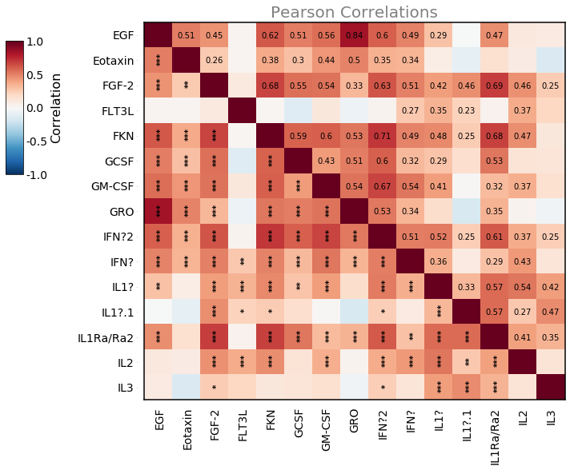
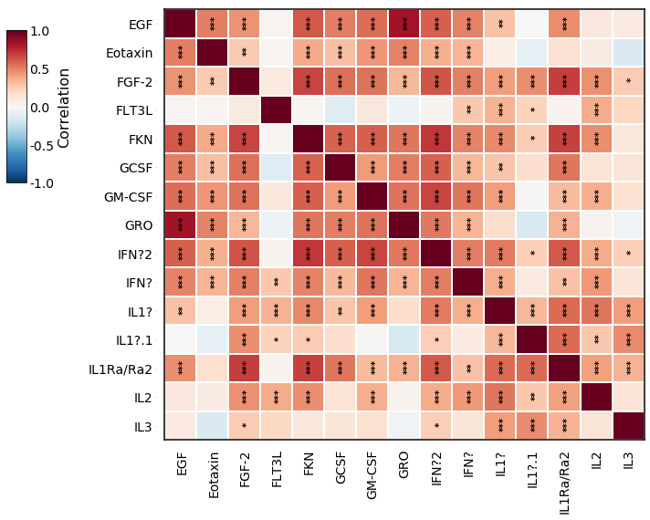
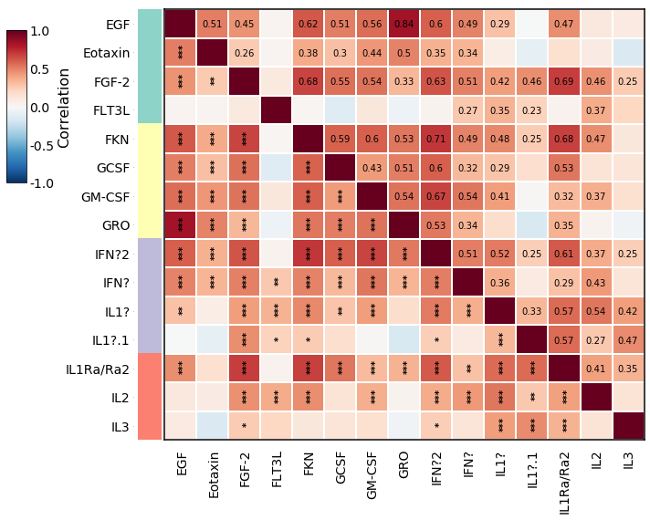
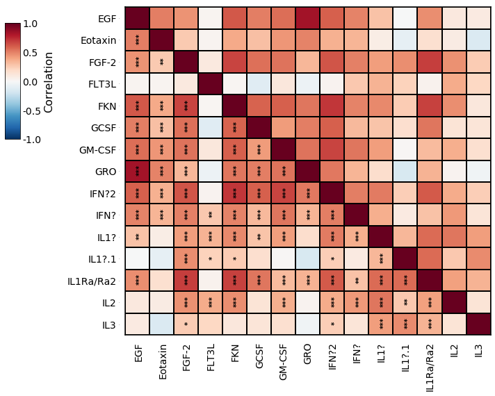
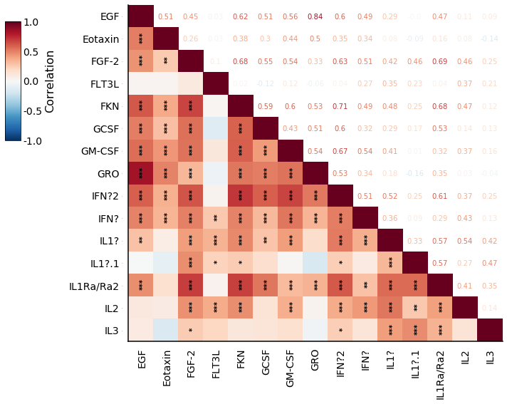
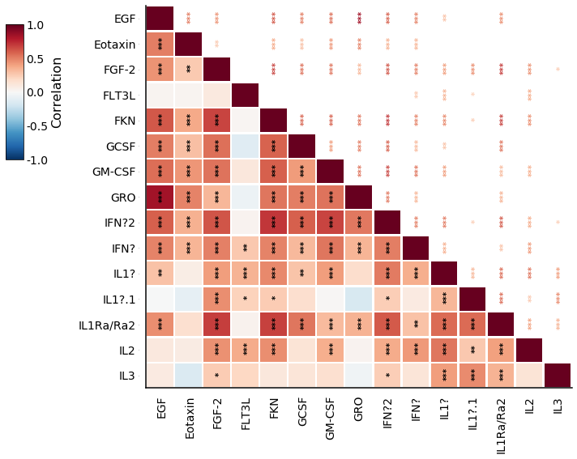
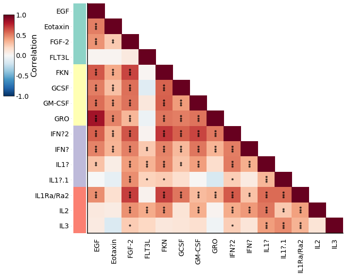

# SigniCorr

Script for plotting a pairwise correlation matrix as heatmap with annotated p-values, after applying multiplicity adjustment for multiple hypothesis testing.

# SigniCorr plot example


```python
# If signi_corr is not in the same path as this notebook, 
# uncomment these 2 rows and change 'folder' to path where signi_corr.py is stored:
# import sys
# sys.path.append('folder') 

import signi_corr
import pandas as pd
import matplotlib.pyplot as plt
```

## Import example data


```python
df = pd.read_csv('cytokine_data.csv', index_col=0) # cytokine_data.csv shoulb be stored in the same folder as this notebook
df.dropna(axis='index', how='all', inplace=True)
df = df.iloc[:, 0:15]
df.head()
```


<div>
<style scoped>
    .dataframe tbody tr th:only-of-type {
        vertical-align: middle;
    }

    .dataframe tbody tr th {
        vertical-align: top;
    }

    .dataframe thead th {
        text-align: right;
    }
</style>
<table border="1" class="dataframe">
  <thead>
    <tr style="text-align: right;">
      <th></th>
      <th>EGF</th>
      <th>Eotaxin</th>
      <th>FGF-2</th>
      <th>FLT3L</th>
      <th>FKN</th>
      <th>GCSF</th>
      <th>GM-CSF</th>
      <th>GRO</th>
      <th>IFN?2</th>
      <th>IFN?</th>
      <th>IL1?</th>
      <th>IL1?.1</th>
      <th>IL1Ra/Ra2</th>
      <th>IL2</th>
      <th>IL3</th>
    </tr>
    <tr>
      <th>ID</th>
      <th></th>
      <th></th>
      <th></th>
      <th></th>
      <th></th>
      <th></th>
      <th></th>
      <th></th>
      <th></th>
      <th></th>
      <th></th>
      <th></th>
      <th></th>
      <th></th>
      <th></th>
    </tr>
  </thead>
  <tbody>
    <tr>
      <td>3200</td>
      <td>5.24</td>
      <td>24.34</td>
      <td>39.02</td>
      <td>1.94</td>
      <td>20.86</td>
      <td>39.52</td>
      <td>6.60</td>
      <td>98.41</td>
      <td>8.12</td>
      <td>9.97</td>
      <td>2.24</td>
      <td>2.83</td>
      <td>24.24</td>
      <td>0.95</td>
      <td>2.76</td>
    </tr>
    <tr>
      <td>3202</td>
      <td>179.16</td>
      <td>39.41</td>
      <td>28.62</td>
      <td>2.50</td>
      <td>49.11</td>
      <td>20.92</td>
      <td>356.27</td>
      <td>1019.90</td>
      <td>27.21</td>
      <td>8.36</td>
      <td>17.34</td>
      <td>1.80</td>
      <td>5.67</td>
      <td>1.49</td>
      <td>1.67</td>
    </tr>
    <tr>
      <td>3204</td>
      <td>191.72</td>
      <td>42.49</td>
      <td>7.68</td>
      <td>0.67</td>
      <td>33.36</td>
      <td>10.44</td>
      <td>22.71</td>
      <td>2038.28</td>
      <td>25.98</td>
      <td>7.36</td>
      <td>0.13</td>
      <td>0.28</td>
      <td>2.25</td>
      <td>0.45</td>
      <td>0.27</td>
    </tr>
    <tr>
      <td>3206</td>
      <td>132.00</td>
      <td>93.76</td>
      <td>33.89</td>
      <td>0.47</td>
      <td>128.00</td>
      <td>67.87</td>
      <td>147.00</td>
      <td>4132.00</td>
      <td>27.43</td>
      <td>13.54</td>
      <td>49.02</td>
      <td>0.18</td>
      <td>22.54</td>
      <td>3.48</td>
      <td>5.25</td>
    </tr>
    <tr>
      <td>3209</td>
      <td>12.91</td>
      <td>18.75</td>
      <td>17.37</td>
      <td>2.50</td>
      <td>2.62</td>
      <td>12.83</td>
      <td>231.27</td>
      <td>149.67</td>
      <td>6.48</td>
      <td>63.64</td>
      <td>10.52</td>
      <td>1.61</td>
      <td>1.88</td>
      <td>1.25</td>
      <td>1.67</td>
    </tr>
  </tbody>
</table>
</div>


Example categories


```python
categories = {col: 1+int(5*i/20) for i,col in enumerate(df.columns)}
print(categories)
```

    {'EGF': 1, 'Eotaxin': 1, 'FGF-2': 1, 'FLT3L': 1, 'FKN': 2, 'GCSF': 2, 'GM-CSF': 2, 'GRO': 2, 'IFN?2': 3, 'IFN?': 3, 'IL1?': 3, 'IL1?.1': 3, 'IL1Ra/Ra2': 4, 'IL2': 4, 'IL3': 4}
    

### plot_signi_corr function documentation


```python
help(signi_corr.plot_signi_corr)
```

    Help on function plot_signi_corr in module signi_corr:
    
    plot_signi_corr(df, method='spearman', show_significance=True, signif_by_method='FWER', censor_type='FDR', censor_thresh=1, color_only_lower_triangle=False, numbers_upper=True, asterisks_upper=False, figsize=(10, 8), title='', title_fontsize=20, title_color='black', colorbar_title='Correlation', colorscale_fontsize_title=16, colorscale_fontsize_ticks=14, ticks_fontsize=14, asterisks_x=0.6, asterisks_y=0.44, numbers_x=0.55, numbers_y=0.48, aster_size=10, numbers_size=10, grid_colors='white', grid_width=0, label_category=None, label_cmap=None, main_left=0.25, main_bottom=0.17, main_right=0.98, main_top=0.99, colorbar_left=0.01, colorbar_bottom=0.66, colorbar_right=0.04, colorbar_top=0.95)
        Gets a dataframe with numeric columns, calculate the pairwise correlations between
        the columns and portray them in a heatmap. Heatmap colors show the correlation coefficient.
        Correlation coefficients can be annotated with numbers (numbers_upper=True).
        Significance is annotated with asterisks (show_significance=True).
        pvalues can be adjusted for multiple testing using FDR or FWER (signif_by_method).
        * When show_significance=True, correlation coefficient number are only annotated
        if significant.
        Asterisks indicate p-values (or FDR or FWER) with ***, **, and *
        indicating p ≤ 0.0005, 0.005, and 0.05, respectively
        
        :param df: pandas dataframe
        :param method: for calculating correlations - 'spearman' or 'pearson'
        :param show_significance: show significance asterisks.
                                  If True, and numbers_upper is True,
                                  will only annotate numbers when significant
                                  (according to asterisks_by_method)
        :param signif_by_method: adjustment method to use for significance
                                 annotation - 'FWER', 'FDR' or 'pvals'
                                 (i.e., without multiplicity adjustment)
        :param censor_type: adjustment method to use for censoring cells -
                            'FWER', 'FDR' or 'pvals' (i.e., without multiplicity adjustment)
        :param censor_thresh: threshold over which cells should be censored based on
                              censor_type: adjustment method.
                              Defaule 1 - no censoring
        :param color_only_lower_triangle: Show only lower triangle heatmap (with or without
                                    annotating the correlation coefficient in the
                                    upper triangle - depending on parameter numbers_upper
        :param numbers_upper: annotate the correlation coefficient in the
                              upper triangle, only for significant values (unless show_significance=False)
        :param asterisks_upper: annotate the pvals in the upper triangle
        :param figsize: figure size
        :param title: figure title. Default ''
        :param title_fontsize: figure title fontsize. Default 20
        :param title_color: figure title fontsize. Default 'black'
        :param colorbar_title: colorbar label string
        :param colorscale_fontsize_title:
        :param colorscale_fontsize_ticks:
        :param ticks_fontsize: fontsize of the ticks (df column names)
        
        :param asterisks_x: shift the astersiks text on x axis
        :param asterisks_y: shift the astersiks text on y axis
        :param numbers_x: shift the numbers text on x axis
        :param numbers_y: shift the numbers text on y axis
        :param aster_size: fontsize of asterisks to annotate
        :param numbers_size: fontsize of numbers to annotate
        :param grid_colors: heatmap "grid" color
        :param grid_width: heatmap "grid" line width
        :param label_category: pd.Series - add color to each row by these categories.
        :param label_cmap: color map for label categories
        :param main_left: shift the heatmap edges
        :param main_bottom: shift the heatmap edges
        :param main_right: shift the heatmap edges
        :param main_top: shift the heatmap edges
        :param colorbar_left: shift the colorbar edges
        :param colorbar_bottom: shift the colorbar edges
        :param colorbar_right: shift the colorbar edges
        :param colorbar_top: shift the colorbar edges
        
        :return: matplotlib figure object
    
    

## Example SigniCorr Plots


```python
signi_corr.plot_signi_corr(df, method='spearman',
              show_significance=True,
              signif_by_method='FWER', censor_type='FDR',
              color_only_lower_triangle=False,
              numbers_upper=True,
              asterisks_upper=False,
              figsize=(10, 8),
              title='Pearson Correlations', title_fontsize=20, title_color='grey'
              )
plt.show()
```

    Warning! a diag value is not 1. check for double indexes!
    Warning! a diag value is not 1. check for double indexes!
    Warning! a diag value is not 1. check for double indexes!
    Warning! a diag value is not 1. check for double indexes!
    Warning! a diag value is not 1. check for double indexes!
    

    D:\Liel\Dropbox\PyCharm\PycharmProjectsNew\SigniCorr_git\signi_corr.py:413: UserWarning: This figure includes Axes that are not compatible with tight_layout, so results might be incorrect.
      plt.tight_layout()
    


    

    


```python
signi_corr.plot_signi_corr(df, method='spearman',
              show_significance=True,
              signif_by_method='FWER', censor_type='FDR',
              color_only_lower_triangle=False,
              numbers_upper=False,
              asterisks_upper=True,
              figsize=(10, 8),
              grid_colors='white', grid_width=1,
              )
plt.show()
```

    Warning! a diag value is not 1. check for double indexes!
    Warning! a diag value is not 1. check for double indexes!
    Warning! a diag value is not 1. check for double indexes!
    Warning! a diag value is not 1. check for double indexes!
    Warning! a diag value is not 1. check for double indexes!
    


    

    


```python
signi_corr.plot_signi_corr(df, method='spearman',
              show_significance=True,
              signif_by_method='FWER', censor_type='FDR',
              color_only_lower_triangle=False,
              numbers_upper=True,
              asterisks_upper=False,
              figsize=(10, 8),
              grid_colors='white', grid_width=1,
              label_category=pd.Series(categories)
              )
plt.show()
```

    Warning! a diag value is not 1. check for double indexes!
    Warning! a diag value is not 1. check for double indexes!
    Warning! a diag value is not 1. check for double indexes!
    Warning! a diag value is not 1. check for double indexes!
    Warning! a diag value is not 1. check for double indexes!
    


    

    


```python
signi_corr.plot_signi_corr(df, method='spearman',
              show_significance=True,
              signif_by_method='FWER', censor_type='FDR',
              color_only_lower_triangle=False,
              numbers_upper=False,
              asterisks_upper=False,
              figsize=(10, 8),
              grid_colors='black', grid_width=1,
              )
plt.show()
```

    Warning! a diag value is not 1. check for double indexes!
    Warning! a diag value is not 1. check for double indexes!
    Warning! a diag value is not 1. check for double indexes!
    Warning! a diag value is not 1. check for double indexes!
    Warning! a diag value is not 1. check for double indexes!
    


    

    


```python
signi_corr.plot_signi_corr(df, method='spearman',
              show_significance=True,
              signif_by_method='FWER', censor_type='FDR',
              color_only_lower_triangle=True,
              numbers_upper=True,
              asterisks_upper=False,
              figsize=(10, 8),
              )
plt.show()
```

    Warning! a diag value is not 1. check for double indexes!
    Warning! a diag value is not 1. check for double indexes!
    Warning! a diag value is not 1. check for double indexes!
    Warning! a diag value is not 1. check for double indexes!
    Warning! a diag value is not 1. check for double indexes!
    


    

    


```python
signi_corr.plot_signi_corr(df, method='spearman',
              show_significance=True,
              signif_by_method='FWER', censor_type='FDR',
              color_only_lower_triangle=True,
              numbers_upper=False,
              asterisks_upper=True,
              figsize=(10, 8),
              grid_colors='white', grid_width=1.4,
              )
plt.show()
```

    Warning! a diag value is not 1. check for double indexes!
    Warning! a diag value is not 1. check for double indexes!
    Warning! a diag value is not 1. check for double indexes!
    Warning! a diag value is not 1. check for double indexes!
    Warning! a diag value is not 1. check for double indexes!
    


    

    


```python
signi_corr.plot_signi_corr(df, method='spearman',
              show_significance=True,
              signif_by_method='FWER', censor_type='FDR',
              color_only_lower_triangle=True,
              numbers_upper=False,
              asterisks_upper=False,
              figsize=(10, 8),
              label_category=pd.Series(categories)
              )
plt.show()
```

    Warning! a diag value is not 1. check for double indexes!
    Warning! a diag value is not 1. check for double indexes!
    Warning! a diag value is not 1. check for double indexes!
    Warning! a diag value is not 1. check for double indexes!
    Warning! a diag value is not 1. check for double indexes!
    


    

    

